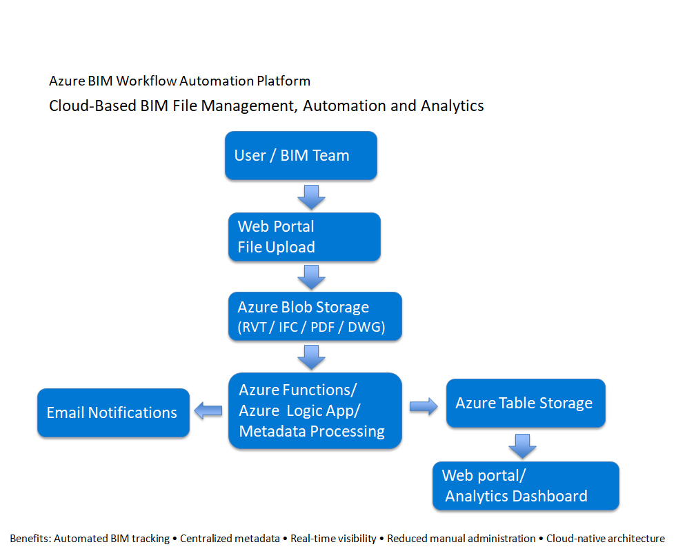
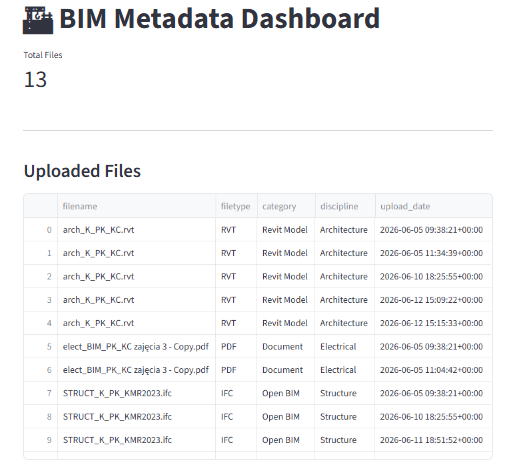
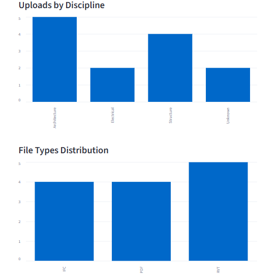
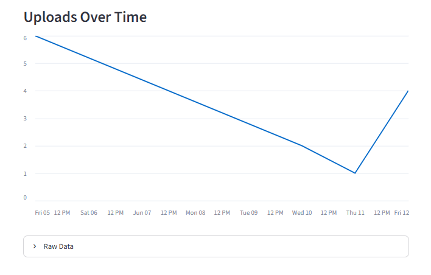

# Azure BIM Workflow Automation Platform
Live Demo

Microsoft authentication required.

https://azure-bim-platform.streamlit.app



## Dashboard




## Overview

The Azure BIM Workflow Automation Platform is a cloud-based solution designed to improve the management, tracking, and visibility of Building Information Modelling (BIM) files throughout a construction project lifecycle.

BIM projects typically involve multiple disciplines such as Architecture, Structure, MEP (Mechanical, Electrical and Plumbing), and Civil Engineering. As projects grow, hundreds of files are exchanged between teams, making it difficult to maintain visibility, ensure correct file distribution, and track project information efficiently.

This project demonstrates how Microsoft Azure cloud services can automate these processes and provide real-time project insights.

---

## The Problem

In many projects, BIM files are manually uploaded, stored, and distributed.

Common challenges include:

* Lack of visibility over uploaded files
* Manual tracking using spreadsheets
* Time-consuming file management
* Difficulty identifying file disciplines and categories
* Delayed notifications to project teams
* Limited reporting and analytics
* Risk of missing or outdated information

As the number of files increases, these manual processes become inefficient and error-prone.

---

## The Solution

This platform automates the BIM file management workflow.

When a user uploads a BIM file through the web application:

1. The file is stored in Azure Blob Storage.
2. An Azure Function is automatically triggered.
3. File metadata is extracted and categorized.
4. Information is stored in Azure Table Storage.
5. Notifications can be sent automatically.
6. The Streamlit dashboard updates with the latest project information.

This creates a centralized and automated workflow that improves project visibility and reduces manual effort.

---

## Architecture

```text
User
  │
  ▼
Streamlit Web Application
  │
  ▼
Azure Blob Storage
  │
  ▼
Azure Functions
  │
  ├── Metadata Extraction
  ├── File Classification
  ├── Notifications
  │
  ▼
Azure Table Storage
  │
  ▼
Streamlit Analytics Dashboard
```

---

## Key Features

### BIM File Upload

Users can upload BIM-related files including:

* Revit (.rvt)
* PLN (.pln)
* IFC (.ifc)
* PDF (.pdf)
* DWG (.dwg)

### Automated Metadata Processing

The platform automatically identifies:

* File name
* File type
* Versioning
* Category
* Discipline
* Upload date
* Upload_by
* File size

### Centralized Metadata Repository

All extracted information is stored in Azure Table Storage for fast retrieval and reporting.

### Analytics Dashboard

The Streamlit dashboard provides:

* Total uploaded files
* Upload history
* File type distribution
* Discipline breakdown
* Project visibility metrics

### Workflow Notifications

Email notifications can be generated automatically whenever new files are added.

---

## Technologies Used

### Cloud Services

* Microsoft Azure
* Azure Blob Storage
* Azure Functions
* Azure Table Storage
* Azure Logic Apps

### Development

* Python
* JavaScript (Node.js)
* Streamlit

### DevOps & Infrastructure

* Terraform
* Docker
* GitHub Actions (CI/CD)

---

## Benefits

This solution demonstrates how cloud technologies can modernize BIM workflows by:

* Reducing manual administration
* Improving project visibility
* Centralizing BIM information
* Automating repetitive tasks
* Supporting scalable document management
* Providing real-time analytics

---

## Future Improvements

Planned enhancements include:

* Advanced BIM analytics
* Power BI integration
* Automated project reporting

---

## Learning Objectives

This project was developed to demonstrate practical experience with:

* Cloud Computing
* Infrastructure as Code (Terraform)
* Serverless Architecture
* Workflow Automation
* DevOps Practices
* Data Analytics Dashboards
* BIM Digital Transformation

The platform showcases how modern cloud technologies can support digital construction and BIM information management workflows.
